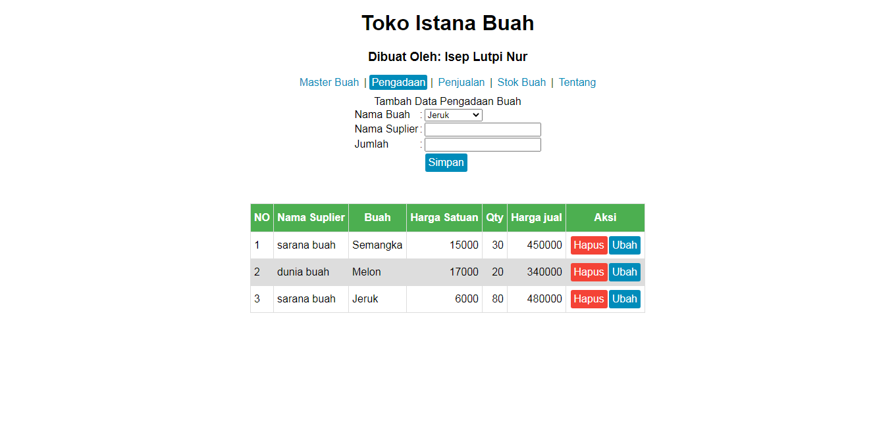

# Toko Istana Buah
Aplikasi sangat sederhana ini bertujuan untuk mengelola toko buah, menggunakan 1 halaman dengan html dan javascrip/ Dibuat dari soal Ujian akhir semester

https://iseplutpinur.github.io/istanabuah/

#### Fitur
- Tambah Data
	-Nama tidak boleh sama dengan data yang sudah ada
	-Harga jual dan beli tidak boleh nol, kurang dari nol dan kosong
	-Harga jual harus lebih tingi dari harga beli
- Ubah Data
	-Nama tidak boleh sama dengan data yang sudah ada
	-Harga jual dan beli tidak boleh nol, kurang dari nol dan kosong
	-Harga jual harus lebih tingi dari harga beli
	-Merubah data ini akan merubah data pada tabel lain
- Hapus Data
	-Menghapus data master akan menghapus seluruh transaksi yang pada tabel pengadaan dan tabel penjualan
- Lihat Data

#### Fitur
