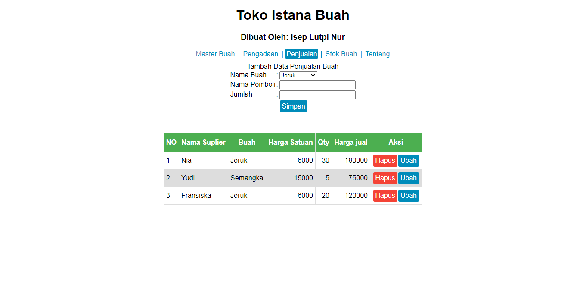
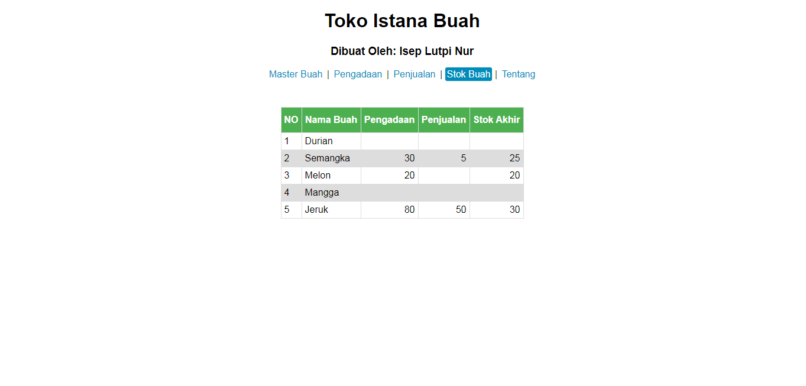

# Toko Istana Buah
Aplikasi sangat sederhana ini bertujuan untuk mengelola toko buah, menggunakan 1 halaman dengan html dan javascrip/ Dibuat dari soal Ujian akhir semester

https://iseplutpinur.github.io/istanabuah/

## Master Buah
- Tambah Data
	- Nama tidak boleh sama dengan data yang sudah ada
	- Harga jual dan beli tidak boleh nol, kurang dari nol dan kosong
	- Harga jual harus lebih tingi dari harga beli
- Ubah Data
	- Nama tidak boleh sama dengan data yang sudah ada
	- Harga jual dan beli tidak boleh nol, kurang dari nol dan kosong
	- Harga jual harus lebih tingi dari harga beli
	- Merubah data ini akan merubah data pada tabel lain
- Hapus Data
	- Menghapus data master akan menghapus seluruh transaksi yang pada tabel pengadaan dan tabel penjualan
- Lihat Data
	- Menampilkan data dalam bentuk tabel

## Pengadaan
- Tambah Data
	- Nama Suplier Tidak boleh kosong
	- Jumlah Tidak boleh kosong
- Ubah Data
	- Nama tidak boleh
	- Data yang dirubah akan merubah data pada tabel lain
	- Jumlah tidak boleh kurang dari stok sehngga stok menjadi minus
- Hapus Data
	- Data tidak bisa dihapus apabila data yang dihapus akan menjadikan stok minus
- Lihat Data
	- Menampilkan data dalam bentuk tabel

## Penjualan
- Tambah Data
	- Menambah data penjualan
	- Jumlah tidak boleh lebih dari stok yang sudah ada
- Ubah Data
	- Jumlah tidak boleh lebih dari stok yang sudah ada
- Hapus Data
	- Menghapus data akan mengembalikan jumlah stok
- Lihat Data
	- Menampilkan data dalam bentuk tabel

## Stok Buah
- Lihat Data
	- Menampilkan data dalam bentuk tabel

